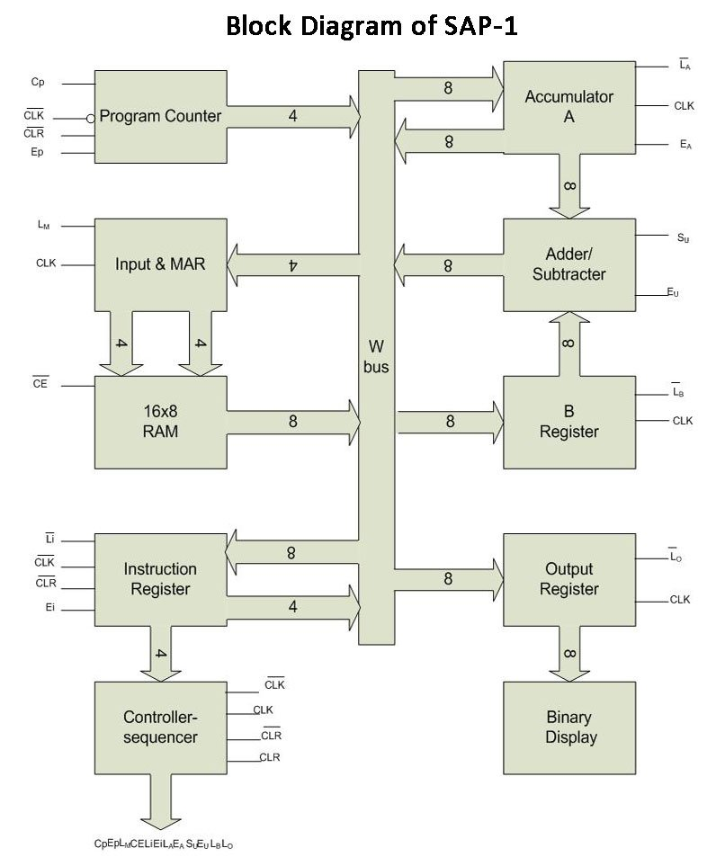

# SAP-1 Architecture Simulation

A functional 8-bit Simple-As-Possible computer built in Logisim.

## Overview

This project is a hardware simulation of the SAP-1 computer. It includes:

- 8-bit data bus
- 16 bytes of RAM
- Extended basic instruction set: LDA, ADD, SUB, STA, JMP, JZ, OUT, HLT
- Accumulator (Register A)
- Temporary Register (Register B)
- ALU (supports addition and subtraction only)
- Memory Address Register (MAR)
- Instruction Register (IR)
- Output Register (displays binary output)
- 4-bit Program Counter (counts from 0 to 15)
- Control Unit

This is a personal learning project. It is not intended for production use, but you are welcome to explore how it was built.

## Getting Started

### Prerequisites

Download and install [Logisim Evolution](https://github.com/logisim-evolution/logisim-evolution).

### Installation

Clone the repository:

git clone https://github.com/imblaze4015/sap1

### Instruction
Open the project file in Logisim Evolution.

Adding Instructions

You can add instructions in two ways:

Manual button input – set manual_input to high, choose the target address, and provide the instruction. The lower 4 bits specify the data address (0–15), and the upper 4 bits specify the command.

Direct HEX editing – poke the RAM contents directly in Logisim and enter the instruction in hexadecimal.

### Instruction Set Architecture
Mnemonic	HEX	Binary
LDA	0	0000
ADD	1	0001
SUB	2	0010
STA	3	0011
JMP	4	0100
JZ	5	0101
OUT	E	1110
HLT	F	1111

### My Journey

Before building this project I studied logic gates. I learned that an entire computer can be constructed from a single gate type (NAND). Starting with NAND gates, I built basic gates like AND, OR, NOT, XOR, NOR, and XNOR, then created combinational circuits such as half adders, full adders, multiplexers, demultiplexers, and decoders. After that I moved on to sequential logic circuits like latches and flip-flops. With these primitives it became possible to build larger components: RAM, registers, ALU, and finally a CPU.

I initially used Sebastian Lague’s Digital Logic Sim because of its clean interface and ease of use for basic circuits. I later switched to Logisim Evolution, which offers higher-level abstractions so you don’t have to build everything from scratch.

I built this SAP-1 simulation before creating my mini-shell project. I hesitated to upload it for a long time, but finally found the courage to share it.

### Challenges

The hardest part of my learning was the transition to sequential and combinational logic circuits. Managing the wiring became increasingly difficult as I moved to larger components like registers, RAM, and the ALU. I kept wondering how professionals handled such complexity. That’s when I understood the power of abstraction. At first I thought I needed to see everything working down to the gate level all at once, and I felt overwhelmed. I later learned that even experts treat each layer as a black box and focus only on the layer they are working on.

The most difficult part of the actual build was connecting everything together and making the SAP-1 work. This required designing the control unit, which orchestrates all the parts. Coordinating the clock cycles so that every circuit operates in harmony was a real challenge.